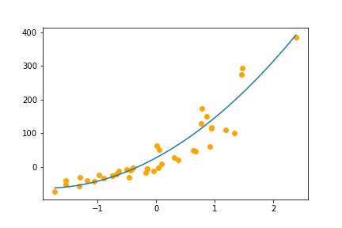

# polyplot
A tiny script to help plot polynomials and polynomial regressions, optionally along with (test) data

## Use case example

First off, download and copy [plot_polynomial.py](plot_polynomial.py) into the same folder as the file 
you want to use it in (.ipynb, .py,...)

```python
import plot_polynomial as polyplot

# polynomial_regression is an sklearn pipeline here
coeffs = polyplot.get_coeffs(polynomial_regression)

# x, y, save and original_data are optional
polyplot.plot_polynomial(coeffs, x_test, y_test, original_data=True, save=False)

# To plot data using both x and y parameters, set original_data=True
# To save your figure to a file named polyplot.png set save=True
```

## Example output

